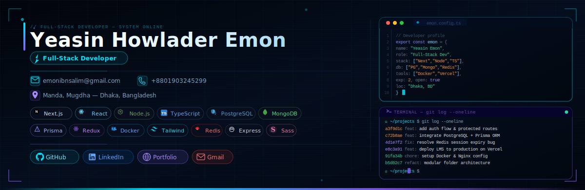

<!-- BANNER — place banner.svg in your repo root -->

 

 

# Assalamualikom, I am Yeasin Howlader Emon

### 🚀 Full Stack Developer | ⚡ Next.js Enthusiast | 🧠 Problem Solver | ⚙️ Node.js & Prisma | 🎯 Focused Builder

<!-- ABOUT ME -->
 

 
## 🧑‍💻 About Me
 
I'm **Yeasin Howlader Emon**, a dedicated **Full-Stack Developer** from 🇧🇩 Dhaka, Bangladesh, with hands-on experience building production-grade web applications from scratch — architecting backends, designing databases, and crafting polished frontends.
 
I've worked across **agencies and startups**, contributing to LMS platforms, HMS applications, farm management systems, and e-commerce services. I care deeply about clean architecture, scalable code, and real impact.
 
Experienced in end-to-end development: from database schema design and REST API architecture to responsive UI with Next.js, TailwindCSS, and Redux Toolkit.
 
 
 
---
 
<!-- CURRENT ACTIVITIES -->
 
## 🔭 Currently Working On

- 🌏 Developing a **Restaurant Management** — modern delavery & booking system & RMS  
- ⚡ Mastering **Next.js (App Router)**, Server Components & Server Actions  
- 🏗️ Improving **System Design Skills** — scalable backend architecture  
- 🤝 Available for **Freelance Projects** & **Open Source Contributions**  
- 💬 Ask me about **React**, **Next.js**, **Node.js**, **MongoDB**, **REST APIs**
 
---
 
<!-- EXPERIENCE -->
 
## 💼 Work Experience
 
| 🏢 Company | 💼 Role | 📅 Duration |
|---|---|---|
| **MAS IT SOLUTION** | Junior Full-Stack Developer + Intern | 8 + 6 months · Remote |
| **Brainee Agency** | Full-Stack Developer | 1 Year · Remote |
 
> Worked on HMS applications, LMS platforms, sports backends, and multi-client projects using **Next.js · Node.js · MongoDB · PostgreSQL · Redis · Docker**.
 
---
 
<!-- SKILLS --> 
 
## 💻 Tech Stack

### 🧠 Languages

  
  

---

### 🌐 Frontend

  
  
  
  
  
  
  
  
  

---

### ⚙️ Backend

  
  

---

### 🗄️ Databases

  
  
  

---

### 🛠️ Tools & DevOps

  
  
  
  
  

 
---
 
<!-- PROJECTS -->
 
## 🚀 Featured Projects
 
<table>
  <tr>
    <td width="50%" valign="top">
      <h3>📚 Open Study</h3>
      
<em>Full Stack Learning Management System</em>

      
      
      
      
      
      
Architected a production-ready LMS from scratch — normalized DB models, secure auth, dynamic routing, course management with admin dashboards.

    </td>
    <td width="50%" valign="top">
      <h3>🐔 Dream Poultry</h3>
      
<em>Poultry Farm Management System</em>

      
      
      
      
      
3-member team build — stock, sales & expense management with REST API integration, protected routes, and clean agile delivery.

    </td>
  </tr>
  <tr>
    <td width="50%" valign="top">
      <h3>🏠 Your House Helper</h3>
      
<em>E-commerce & Home Service Platform</em>

      
      
      
      
      
Full-stack e-commerce & home service platform — product listings, order checkout, admin dashboard, and real-time data flow.

    </td>
  </tr>
</table>
 
---
 
<!-- GITHUB STATS -->
 
## 📊 GitHub Stats
 

 

&nbsp;

 

 

 

 

 

 

 

 
---
 
<!-- SOCIALS -->
 
## 🌐 Find Me Online
 

 

 

 
---
 

 

 

 

 
